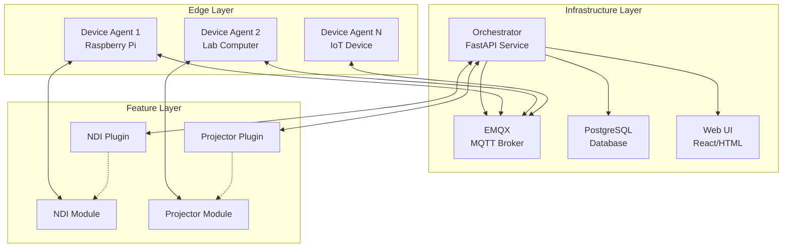
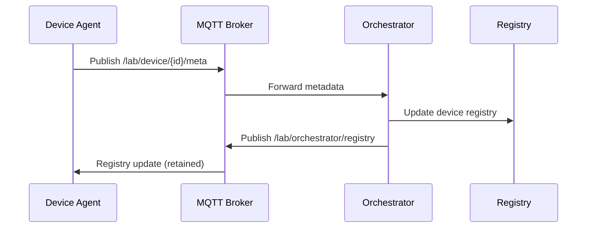
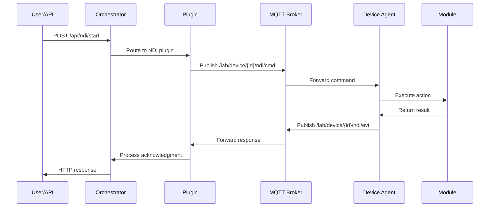

# Lab Platform Architecture

## Overview

The Lab Platform is designed as a distributed, modular system that enables remote control and monitoring of laboratory devices. The architecture emphasizes simplicity, reliability, and extensibility.

## Core Principles

### 1. Separation of Concerns
- **Infrastructure**: Centralized services (orchestrator, MQTT, database)
- **Edge Computing**: Device agents running on lab equipment
- **Features**: Pluggable modules and plugins for specific functionality

### 2. Event-Driven Communication
- **MQTT Protocol**: Reliable, structured messaging between components
- **Topic Hierarchy**: Organized namespace for device and module communication
- **QoS Levels**: Guaranteed delivery for critical messages

### 3. Plugin Architecture
- **Dynamic Loading**: Features discovered and loaded at runtime
- **Manifest-Driven**: Self-describing components with validation
- **Loose Coupling**: Components communicate via well-defined interfaces

## System Components



## Component Details

### Orchestrator (Central Service)

**Purpose**: Central coordination and management service
**Technology**: FastAPI, Python 3.8+
**Deployment**: Docker container

**Key Responsibilities**:
- Device registry and status management
- Plugin lifecycle management
- Web UI serving and API endpoints
- Resource locking and scheduling
- MQTT message routing and handling

**Architecture**:
```python
orchestrator/
├── host.py              # Main FastAPI application
├── plugin_api.py        # Plugin interface and base classes
├── config.py           # Configuration management
├── services/
│   ├── mqtt.py         # MQTT client and message handling
│   ├── registry.py     # Device registry and state management
│   ├── scheduler.py    # Task scheduling and cron jobs
│   └── events.py       # Event handling and acknowledgments
└── ui/                 # Web interface templates and assets
```

**Plugin System**:
- Plugins extend `OrchestratorPlugin` base class
- Automatic discovery via manifest files
- Dynamic API route registration
- MQTT topic subscription and handling
- UI template mounting

### Device Agent (Edge Service)

**Purpose**: Edge device communication and module management
**Technology**: Python 3.8+, asyncio
**Deployment**: Systemd service, Docker, or direct execution

**Key Responsibilities**:
- MQTT connection and communication
- Module discovery and lifecycle management
- Device metadata publication
- Command execution and response handling
- Process management for external tools

**Architecture**:
```python
device-agent/
├── agent.py            # Main agent implementation
├── base.py             # Module base class and interfaces
├── common.py           # MQTT utilities and topic builders
├── config.py           # Configuration loading and validation
├── reconciler.py       # State reconciliation and recovery
└── metrics.py          # System monitoring and health checks
```

**Module System**:
- Modules extend `Module` base class
- Manifest-driven discovery and loading
- Command handling with structured responses
- Process management and cleanup
- Configuration validation and defaults

### MQTT Communication Layer

**Broker**: EMQX (Eclipse Mosquitto compatible)
**Protocol**: MQTT 3.1.1/5.0 with QoS 1 for reliability

**Topic Structure**:
```
/lab/
├── device/{device_id}/
│   ├── meta                    # Device capabilities and info (retained)
│   ├── status                  # Device health and state (retained)
│   ├── cmd                     # Device-level commands
│   ├── evt                     # Device-level events
│   └── {module}/
│       ├── cmd                 # Module-specific commands
│       ├── cfg                 # Module configuration updates
│       ├── status              # Module status (retained)
│       └── evt                 # Module events and responses
└── orchestrator/
    ├── registry                # Device registry snapshot (retained)
    └── {module}/
        ├── cmd                 # Plugin-to-module commands
        └── evt                 # Plugin events and notifications
```

**Message Format**:
```json
{
  "req_id": "uuid-v4",
  "actor": "api|orchestrator|user",
  "ts": "2024-01-01T00:00:00Z",
  "action": "start|stop|configure|status",
  "params": {
    "device_id": "lab-device-01",
    "key": "value"
  }
}
```

### Feature System

Features consist of paired components:
- **Module**: Runs on device agent, handles hardware interaction
- **Plugin**: Runs on orchestrator, provides UI and API

**Module Lifecycle**:
1. Discovery via manifest scanning
2. Class loading and instantiation
3. Configuration application
4. Registration with agent
5. Command handling and state management
6. Cleanup on shutdown

**Plugin Lifecycle**:
1. Discovery via manifest scanning
2. Class loading and instantiation
3. MQTT topic subscription
4. API route registration
5. UI template mounting
6. Event handling and forwarding

## Data Flow

### Device Registration


### Command Execution


## Configuration Management

### Environment-Based Configuration
- **Infrastructure**: Docker Compose environment variables
- **Device Agents**: .env files with local overrides
- **Features**: Manifest-driven with runtime configuration

### Configuration Hierarchy
1. **Defaults**: Built into code and manifests
2. **Environment**: .env files and environment variables
3. **Runtime**: MQTT configuration messages
4. **User**: Web UI and API overrides

### Validation and Schema
- **JSON Schema**: Configuration validation
- **Type Hints**: Python type checking
- **Manifest Validation**: Feature capability verification

## Security Model

### Authentication and Authorization
- **MQTT**: Username/password authentication
- **API**: Token-based authentication (future)
- **Network**: Docker network isolation

### Message Security
- **QoS 1**: Guaranteed delivery for critical messages
- **Retained Messages**: State persistence and recovery
- **Topic ACLs**: Permission-based topic access (future)

### Input Validation
- **Pydantic Models**: Request/response validation
- **Parameter Sanitization**: Command parameter filtering
- **Schema Validation**: Configuration and manifest checking

## Scalability and Performance

### Horizontal Scaling
- **Multiple Agents**: Independent device agents
- **Plugin Isolation**: Separate processes for plugins (future)
- **Database Sharding**: Distributed data storage (future)

### Performance Optimization
- **Async I/O**: Non-blocking network operations
- **Connection Pooling**: Efficient resource utilization
- **Message Batching**: Reduced MQTT overhead
- **Caching**: Registry and state caching

### Monitoring and Observability
- **Health Checks**: Component and system health monitoring
- **Metrics Collection**: Performance and usage metrics
- **Structured Logging**: JSON logs with correlation IDs
- **Distributed Tracing**: Request flow tracking (future)

## Deployment Architecture

### Development Environment
```yaml
services:
  emqx:
    image: emqx/emqx:5.8
    ports: [1883, 18083]
  
  db:
    image: postgres:15
    environment:
      POSTGRES_DB: lab_platform
  
  orchestrator:
    build: .
    depends_on: [emqx, db]
    ports: [8000]
```

### Production Environment
- **Load Balancer**: HAProxy or Nginx
- **Container Orchestration**: Kubernetes or Docker Swarm
- **Database**: Managed PostgreSQL (RDS, CloudSQL)
- **MQTT**: Clustered EMQX deployment
- **Monitoring**: Prometheus, Grafana, ELK stack

## Error Handling and Recovery

### Fault Tolerance
- **Graceful Degradation**: Service continues with reduced functionality
- **Circuit Breakers**: Prevent cascade failures
- **Retry Logic**: Exponential backoff for transient failures
- **State Recovery**: Persistent state and recovery mechanisms

### Error Propagation
- **Structured Errors**: Consistent error format across components
- **Error Codes**: Standardized error classification
- **User Feedback**: Meaningful error messages in UI
- **Logging**: Comprehensive error logging and tracking

## Future Enhancements

### Planned Features
- **Multi-tenancy**: Support for multiple organizations
- **Role-based Access**: Fine-grained permissions
- **Workflow Engine**: Complex automation sequences
- **Real-time Analytics**: Live data processing and visualization
- **Mobile App**: Native mobile device management

### Architectural Evolution
- **Microservices**: Further service decomposition
- **Event Sourcing**: Complete audit trail and replay capability
- **GraphQL API**: Flexible query interface
- **WebSocket Support**: Real-time web updates
- **Edge Computing**: Distributed processing capabilities
